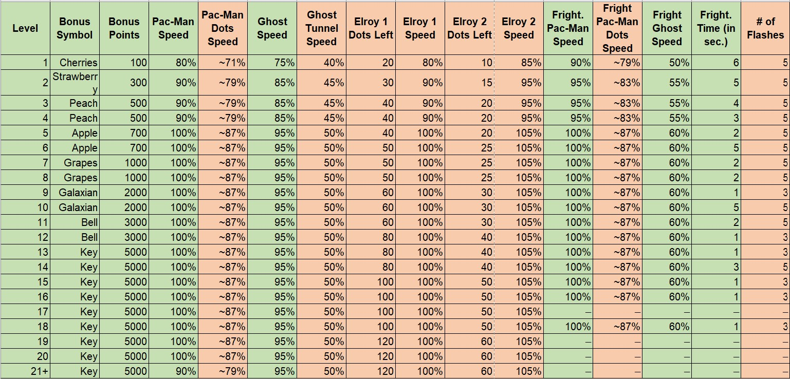

# Experimental Pacman - AI Personality and Cognition (AiPerCog) Research Project

## Content

This repository contains the Unity (version 2022.3.20f1) project of our Pacman implementation. It is designed to work along with a [remote server with MySQL database](https://version.helsinki.fi/hipercog/behavlets/Web-Pacman) to collect gameplay data. The resulting data will be encoded and analyzed with [Pacman Behavlets Encoding System](https://version.helsinki.fi/hipercog/behavlets/encoder-pacman)

Relevant code is in Assets/Scripts

## Table of differences between [Original game](https://pacman.holenet.info/), this implementation (Unity Pacman) and [previous research](https://version.helsinki.fi/hipercog/behavlets/DXPacMan)(DX Pacman) (see below for detailed description)

| Feature | Original | Unity Pacman | DX Pacman |
| ----------- | ----------- | ----------- | ----------- |
| Goal of the game | Eat 244 pellets, while avoiding ghosts | Similar | ------- |
| Map space | 26x29 movable tiles | Similar | ------- |
| Power pellets | 4 power pellets that allow Pacman to eat ghosts for a brief period | Similar | ------- |
| Fruits | 2 fruits that appear at different times | Similar | ------- |
| Ghost behavior | 4 ghosts with different targeting behavior | 4 ghosts with same targeting behavior | ------- |
| Targeting heuristic | Based on a simple vector distance heuristic | Similar | ------- |
| Collision determination | On the entrance of the tile | Physics 2D circular colliders, with a radius of 0.5 units | ------- |
| Ghost movement decision | Determined on every intersection | Same | ------- |
| Exploitable areas | Map contains areas to exploit (see Dossier) | No areas to exploit | ------- |
| Red ghost behavior | Increases speed twice during the game (Cruise Elroy) and has a more aggressive behavior | All ghosts have the same speed (No Cruise Elroy) and similar behavior | ------- |
| Ghost speed in tunnels | Reduced speed | Same speed | ------- |
| Game speed | 100% speed is 75.76 pixels/second or (9.47 tiles/sec) | Same (100% = 9.47 unity's units/sec) | ------- |
| Pacman speed | 5% higher than ghosts, except when eating power pellets | Similar, but from level 21+ the speed of the ghosts is 5% faster than Pacman | ------- |
| Fright time | Starts at 6 seconds and decreases each level | Starts at 6 seconds and decreases each level | ------- |
| Cutscenes | After level 5 and 9, followed by longer frightened times for the following level (5 seconds) | No cutscenes, but frightened time increases at level 6 and 10 | ------- |
| Ghost behavior switching | Between chase/scatter based on level and pill-dependent functions | Heuristically, scatter during 6 secs, chase for 20 secs, and iterate | ------- |
| Ghost scatter behavior | Each ghost has an assigned quadrant to patrol | Same | ------- |
| Ghost departure timing | Based on counters, dependent on time and pellets eaten | Based on a timer, decreasing with level progression | ------- |
| Ghost flashing | Varies on levels before turning normal from frightened state | Always flash 3 times before changing | ------- |
| Game freezing on ghost eating | Freezes when Pacman eats a ghost | Game continues while Pacman eats a ghost | ------- |
| Game freezing on Pacman death | Freezes when Pacman dies | Similar | ------- |
| Level progression | Increases challenges by changing several variables of the game | Simplified progression, as shown in table below | ------- |

## Level Progression Comparison between Original and Unity Pacman (Red columns were removed, except for # of flashes, which is fixed to 3)

# Detailed description

## Game Design

This is a non-standard implementation of Pacman, designed for research in gamer behavior. The game is built upon the educational example developed by [Zigurous](https://github.com/zigurous/unity-pacman-tutorial) with tweaked and new elements based on the [Pacman Dossier by Jamey Pittman](https://pacman.holenet.info/). However, simplifying for our research purposes, it is not an exact replica of the original game.

Map space is the standard of 26x29 tiles (walkable map, not considering UI space). Each tile is a 1x1 square, measured in Unity's x,y reference system. Pacman and ghosts speeds are proportional to the maximum speed of 9.47 tiles/sec [(75.76 pixels/seconds)](https://pacman.holenet.info/#LvlSpecs). While the pixels/sec might vary across clients, movement relative to the map remains constant and accurate to the original game, since map size and speed is defined by Unity measures.

Pacman and ghost speed only varies with level progression and by eating the power pills (energizers), unlike the original game, where pacman is slowed down when eating dots and ghosts when traversing the tunnels.

### Difficulty progression and Ghost behavior
Difficulty increases by modifying the speed, the frightened duration, and ghosts' home departure. Ghost Behavior is one of the main differences with the original game, details below.

Speed:

- Pacman speed is 5% higher than the ghosts except when eating a powerpill, where the difference in speeds is of 40% Progression in speed follows closely the original game's values, as described in the Pacman Dossier. Maximum speed, both for Pacman and Ghosts, is reached at level 5. However, at level 21+ ghosts' speed become 5% higher than Pacman

Fright time:
- Fright time starts at 6 seconds and it becomes shorter each level. However, it does not follow a logical progression. For example, in level 9 the fright time is 1 second, in level 10 is of 5 seconds, and in level 11 returns to 1 second. This brings unpredictability on assessing the risk of hunting ghosts.
- In original pacman, the number of flashes that frightened ghosts have is related to the timing and the moment where they turn. During the first 11 levels, ghost are going to flash 5 times before turning. This gives some guide to predict and watch for the turn in behavior. In this implementation, flashing of the ghosts is simplified and it always flicker three times, starting from half the frightened duration, before turning back to normal. This can be modified easily, by adding the level values in the levelData array (GameManager.cs) and modifying the loadleveldata() method to alter the "flickercount" variable in GhostFrightened.cs script.

Ghosts' home departure:
- Ghosts departure from home is simplified. Every ghost has a pre-defined timer to leave home. This timer decreases linearly with level progression, reaching its minimum at lvl 13. 
- Same rule applies for the time the ghosts spend at home after getting eaten.

Ghost behavior:
- After departure, each ghost scatters to patrol an assigned quadrant, following the original game's behavior.
- During the game they alternate between chase/scatter behavior. As difficulty increases, the sooner and longer they are in chasing behavior.
- Movement is guided by a grid of nodes positioned at each intersection. Ghost wont change path in the middle of a passage/tunnel
- When chasing Pacman, the targetting system is Same for every ghost. They chase pacman directly using a heuristic distance metric, Same to Blinky in the original game. This is a simplification of the original game, where each ghost has a different targetting behavior. As a consequence, the game is more challenging, as every ghost behaves as the most agressive one in the original game.
- In the original game, Blinky increases its speed twice during the game when a certain amount of pellets are eaten. In this version, Blinky is not faster than the other ghosts and there is no ["Cruise Elroy" speed boost](https://pacman.holenet.info/#CH4_Blinky) speed changes. This reduces challenge significantly, as Blinky is the most aggressive ghost in the original game. However, this is somewhat countered by the Same targetting behavior of all ghosts.

## Data Collection

Data collection scripts (Assets/Scripts/DataManagement/*) gather and sends raw gameplay data to remote server. Server address is defined in MainManager.cs scripts.

Data collected is divided in two tables, "game" and "gamestate":

### "Game" Table:

Contains higher level data of a single game/round/level of Pacman played. A game ends when player loses all lives or wins and moves to a higher level:

- *user_id*: represents player's unique identifier. retrieved on log-in
- *session_number*: represents the session number in which the game was played (increments each time the user logs in and plays a game)
- *game_in_session*: represents the position of the game within the current session
- *source*: represents the source from where the client is playing the game (e.g., itch.io, University's server, etc.)
- *date played*
- *game duration*
- *win*: 0 for lost game , 1 for a win
- *level*: Difficulty level of the game

### "Gamestate" Table:

- *game_id*
- *time elapsed*: since the start of the round (timer starts as soon as the movement is enabled)
- *score*
- *lives*
- *positions of Pacman and Ghosts*: Positions are sent in (x,y) structure. Values range from -12.5 < x < 12.5 ; -15.5 < y > 12.5
- *pacman attack state*: represents the state when pacman is eating a ghost. 0 for normal, 1 for eating a ghost
- *ghost states*: represents the ghost active behavior/state. 0 for home, 1 for scattering, 2 for chasing, 3 for frightened, 4 for eaten
- *pellets*: number of remaining pellets and powerpellets
- *Powerpellets*: number of remaining powerpellets. 
- *PowerPellet states*: the state of each individual pellet (1 for not eaten/active, 0 for eaten/unactive), numbered from 1 to 4 according to their position in the map ( see PowerPellet.cs)
- *Fruit states*: state of the fruits. 0 for not spawned, 1 for spawned, 2 for eaten. Two fruits are spawned when remaining pellet count reaches 174 and 74.

## Contact Information

Pablo Flores - pablo.flores@helsinki.fi
University of Helsinki

